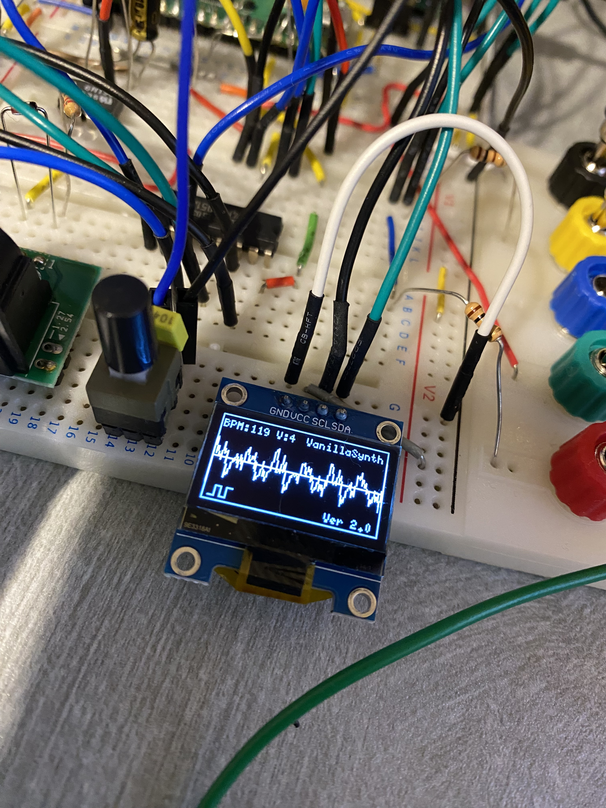

# VanillaSynth V2

Raspberry Pi Pico 2 based polyphonic digital synthesizer.

RP2040 dual-core architecture, I2S DAC audio output, MIDI input and realtime FX.

---

## Prototype

---

## Demo

- Video:
https://youtu.be/2JtVhN9wDcU

- Setup animation: 
https://github.com/user-attachments/assets/5eb53d64-d70e-479a-b6a4-3ed6ece25c10

- Waveform demo:
https://github.com/user-attachments/assets/80457c1c-6252-4934-953d-d8e9c80b8a95

---

## Schematic

[VanillsSynth_V2_Schematic.pdf](https://github.com/user-attachments/files/25811106/VanillsSynth_V2_Schematic.pdf)

---

## Overview

VanillaSynth V2 is a DIY polyphonic synthesizer built around the Raspberry Pi Pico 2.

It runs entirely on a microcontroller using the RP2040 dual core architecture.

Core0 handles UI and MIDI processing while Core1 runs the realtime audio engine.

The goal of the project is a stable, expressive and simple hardware synthesizer.

## Development Environment

Board  
Raspberry Pi Pico 2 (RP2040)

IDE  
Arduino IDE

Board package  
Arduino-Pico (Earle Philhower core)

Tested version  
rp2040 core 5.5.0

## Libraries

Required libraries:

- I2S (included in Arduino-Pico core)
- Wire (standard Arduino library)
- Adafruit SSD1306
- Adafruit GFX

Install these libraries via the Arduino Library Manager.

---

## Features

• Raspberry Pi Pico 2  
• 4-voice polyphonic virtual analog synthesizer  
• I2S audio output (PCM5102A DAC)  
• MIDI input (UART + 6N138 / 6N136)  
• 74HC4051 analog multiplexer for knob expansion  
• SSD1306 OLED interface  

### Effects

• Phaser  
• Ladder filter  
• Tap ping-pong delay  
• Octaver  
• Soft clip limiter  

---

## Pinout

GP1   MIDI IN  

GP10  I2S BCLK  
GP11  I2S LRCK  
GP12  I2S DATA  

GP2   MUX S0  
GP3   MUX S1  
GP4   MUX S2  

GP26  MUX analog input  

GP6   OLED SDA  
GP7   OLED SCL  

GP14  Wave switch  

GP19  DAC MUTE  

---

## Firmware

Main firmware

[VanillaSynth_V2.ino](firmware/VanillaSynth_V2.ino)

Additional module

[MidiQueue.h](firmware/MidiQueue.h)

---

## License

Firmware  
MIT License

Hardware  
CERN Open Hardware License v2

---

## Author

GolemMilk
